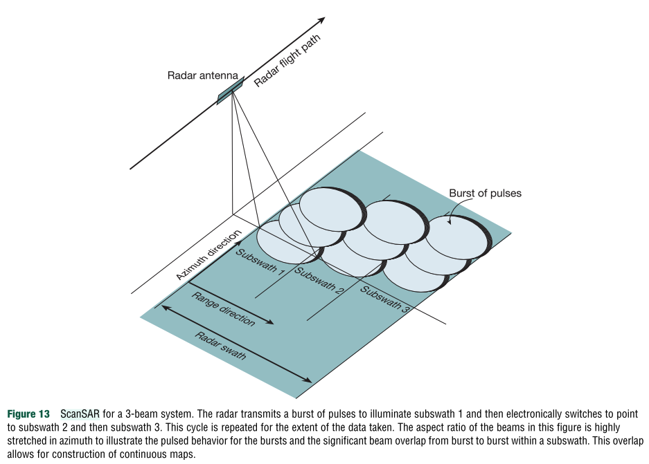

# Getting Started with InSAR

This page contains resources to learn about InSAR **theory** and **interferogram interpretation** for students with a geology or earth science background. Many organisations have already built excellent learning materials — this page points you to the best of them.

---

## What is InSAR?

**Interferometric Synthetic Aperture Radar (InSAR)** is a satellite-based remote sensing technique used to map ground surface deformation. It can detect surface motion at centimetre- to millimetre-scale resolution, making it powerful for studying earthquakes, slow-moving landslides, volcanic unrest, and tectonic creep.

   
  <em>Conceptual overview of SAR acquisition geometry and radar line-of-sight (Simons & Rosen, 2015).</em>

---

## How InSAR works

The technique uses two or more **Synthetic Aperture Radar (SAR)** images collected by orbiting satellites at different times from the same vantage point to measure changes in ground position.

### Key concepts

- **Two passes:** A satellite passes over the same area at least twice.
- **Microwave signals:** A pulse of microwave energy, which propagates through cloud cover, is sent out and the returned signal is measured.
- **Phase measurement:** Each pass measures the phase ($\Phi$) of the radar signal reflected from the ground for every pixel.
- **Interferogram:** Generated by comparing the phase difference ($\Phi_1 - \Phi_2$) between the two passes over a time interval ($t_1 - t_2$).
- **Deformation detection:** If the ground surface moves between acquisitions, the satellite-to-ground distance changes, producing a phase shift. This appears as colourful **fringes** in the interferogram, where one full colour cycle (−π to +π radians) represents motion of **half a radar wavelength** along the satellite line-of-sight.
- **Horizontal and vertical motion:** InSAR measures change in distance between the satellite and the ground (line-of-sight), not vertical motion directly. Once the same scene is observed by ascending (south-to-north) and descending (north-to-south) passes, you can solve for both horizontal and vertical components.

Modern satellites like Sentinel-1 and ALOS-2 use a **ScanSAR** acquisition mode, sweeping the radar beam across multiple sub-swaths to cover wide areas (~250–350 km). Each sub-swath is illuminated in short bursts — understanding this geometry is important when selecting data and choosing between single-burst and multi-burst processing.

   
  <em>ScanSAR acquisition geometry showing the burst-and-subswath structure. The radar transmits a burst of pulses to subswath 1 then switches electronically to subswaths 2 and 3. Burst overlap between subswaths allows construction of continuous maps. From Simons & Rosen (2015).</em>

---

## Common sources of misinterpretation

Before interpreting any pattern, consider each of the following.

1. **Atmospheric delay** — tropospheric and ionospheric signals can produce fringe patterns that closely resemble real deformation. Tropospheric signals tend to be correlated with topography; ionospheric signals produce long-wavelength, range-parallel ramps, particularly in L-band data (Zebker et al., 1997).
2. **Phase unwrapping errors** — discontinuities or false bulleyes introduced during the unwrapping step. These are especially common in low-coherence areas and near phase gradients that exceed half a fringe per pixel.
3. **Geometric effects** — layover and radar shadow in steep terrain produce missing data and apparent discontinuities that have no geophysical meaning.
4. **Line-of-sight ambiguity** — a single interferogram measures displacement only in the radar line-of-sight direction, which mixes vertical and horizontal motion. Separating the two requires ascending and descending tracks, GNSS constraints, or modelling (Wright et al., 2004).
5. **Coherence loss** — low coherence does not indicate deformation; it indicates that the phase signal is unreliable and cannot be interpreted. Coherence loss over a landslide may itself be a signal worth investigating, but it must not be confused with a phase measurement.

!!! warning
    Circular fringe patterns are not sufficient evidence of deformation. Atmospheric artefacts, unwrapping errors, and topographic effects can produce visually similar patterns. Always examine multiple interferograms spanning the same period and compare ascending and descending geometries before drawing conclusions.

---

## Learning pathway

Work through these roughly in order.

### Intro to SAR and InSAR

- **ASF Introduction to SAR** — clear, accessible starting point  
  [https://hyp3-docs.asf.alaska.edu/guides/introduction_to_sar/](https://hyp3-docs.asf.alaska.edu/guides/introduction_to_sar/)

- **NASA Earthdata SAR overview** — non-mathy, good context  
  [https://www.earthdata.nasa.gov/learn/earth-observation-data-basics/sar](https://www.earthdata.nasa.gov/learn/earth-observation-data-basics/sar)

- **EarthScope (UNAVCO) — How to read an interferogram** (Wolf Volcano, Galápagos)  
  [https://www.unavco.org/education/outreach/infographics/lib/images/InSAR-Basics-front.pdf](https://www.unavco.org/education/outreach/infographics/lib/images/InSAR-Basics-front.pdf)

- **USGS Fact Sheet — Monitoring Ground Deformation from Space**  
  [https://pubs.usgs.gov/fs/2005/3025/2005-3025.pdf](https://pubs.usgs.gov/fs/2005/3025/2005-3025.pdf)

- **ASF Sentinel-1 InSAR Product Guide** — understand what you are actually downloading  
  [https://hyp3-docs.asf.alaska.edu/guides/insar_product_guide/](https://hyp3-docs.asf.alaska.edu/guides/insar_product_guide/)

### ASF Storyboards

ASF provide excellent interactive storyboards introducing InSAR concepts and products:  
[https://asf-daac.maps.arcgis.com/home/index.html](https://asf-daac.maps.arcgis.com/home/index.html)

### Reference text

- **Simons, M. & Rosen, P.A.** (2015). Interferometric Synthetic Aperture Radar Geodesy. In: *Treatise on Geophysics*, 2nd ed., Vol. 3 (pp. 339–385). Elsevier.  
  [https://simons.caltech.edu/publications/pdfs/Simons_etal_2015.pdf](https://simons.caltech.edu/publications/pdfs/Simons_etal_2015.pdf)

---

### Short courses

- **EarthScope InSAR short courses** — offered remotely and in person  
  [https://www.earthscope.org/education/skill-building-learning/courses/](https://www.earthscope.org/education/skill-building-learning/courses/)
- 2025 course recordings: [YouTube playlist](https://www.youtube.com/playlist?list=PLGQwSTwiUcKyFTPhELEVOjqzq9rPUJM1f)
- 2025 course notebooks and materials: [GitHub](https://github.com/isceplus/2025-isceplus)

---

## Quick self-check

Before moving on to processing data, make sure you can answer these:

1. What direction does InSAR measure motion in?
2. Why does coherence drop in vegetated areas?
3. How can atmospheric signals be distinguished from real deformation?
4. Why is a single interferogram not enough to determine 3D motion?
5. What additional data helps separate vertical from horizontal motion?

??? note "Answers"

    1. Line-of-sight (change in satellite-to-ground distance).
    2. Vegetation change, moisture change, long time gaps, and viewing geometry differences all decorrelate the phase signal.
    3. Atmospheric signals are patchy, correlated with topography and weather patterns, and inconsistent across multiple interferograms spanning the same event.
    4. A single LOS measurement mixes vertical and horizontal motion and cannot separate them without additional constraints.
    5. Ascending + descending tracks, GNSS displacements, or forward/inverse modelling.

---

## Key references

- **Bürgmann, R., Rosen, P. A., & Fielding, E. J.** (2000). Synthetic aperture radar interferometry to measure Earth's surface topography and its deformation. *Annual Review of Earth and Planetary Sciences*, 28, 169–209.
- **Massonnet, D. et al.** (1993). The displacement field of the Landers earthquake mapped by radar interferometry. *Nature*, 364, 138–142. — *The first interferogram of an earthquake.*
- **Wright, T. J., Parsons, B. E., & Lu, Z.** (2004). Toward mapping surface deformation in three dimensions using InSAR. *Geophysical Research Letters*, 31.
- **Zebker, H. A. et al.** (1997). Atmospheric effects in interferometric synthetic aperture radar surface deformation and topographic maps. *Journal of Geophysical Research*, 102, 7547–7563.
- **Osmanoğlu, B. et al.** (2016). Time series analysis of InSAR data: Methods and trends. *ISPRS Journal of Photogrammetry and Remote Sensing*, 115, 90–102.
