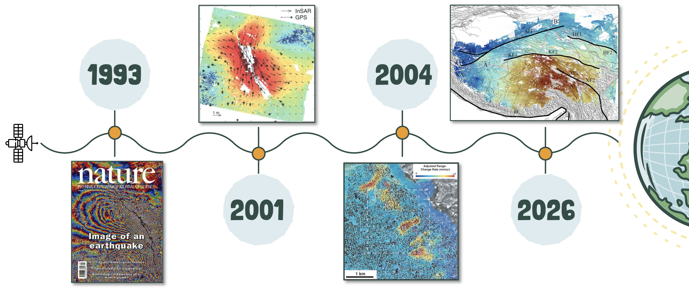

# InSAR Teaching Hub

A curated collection of useful things to get you going with **Interferometric Synthetic Aperture Radar (InSAR)**.

This hub is not a complete learning environment — excellent teaching materials already exist, and this is not trying to replicate them. The goal is to curate the things I've found most helpful, point you to the best resources, and give you a structured pathway into the field. Aimed at masters-level students with a geology or earth science background who have likely encountered InSAR in the literature but have not yet processed or interpreted data themselves.

!!! tip "Best place to start"
    Go straight to the **[Resources](resources.md)** page — the ASF storyboards there are the best freely available introduction to InSAR and should be your first stop.

---

   
  <em>A brief history of InSAR — from the first interferograms to modern time series algorithms.</em>

---

## A suggested pathway

1. **[Resources](resources.md)** — start with the ASF storyboards, then the background reading
2. **[Getting Started](getting-started.md)** — what InSAR measures, how it works, and what to watch out for when interpreting data
3. **[History of InSAR](history.md)** — the key papers and algorithm developments that shaped the field
4. **[Single Interferogram](workflows/single-interferogram.md)** — order and explore your first interferogram using ASF OnDemand
5. **[Time Series](workflows/hyp3-mintpy.md)** — build a displacement time series with HyP3 products and MintPy

---

## About this hub

This resource is maintained by [Danielle Lindsay](https://www.gns.cri.nz/) and updated as new students come through. If something is broken or out of date, raise an issue on GitHub.

!!! note "Using these resources"
    Please credit the original authors of any tools, tutorials, or datasets you use. Attribution links are included throughout.
