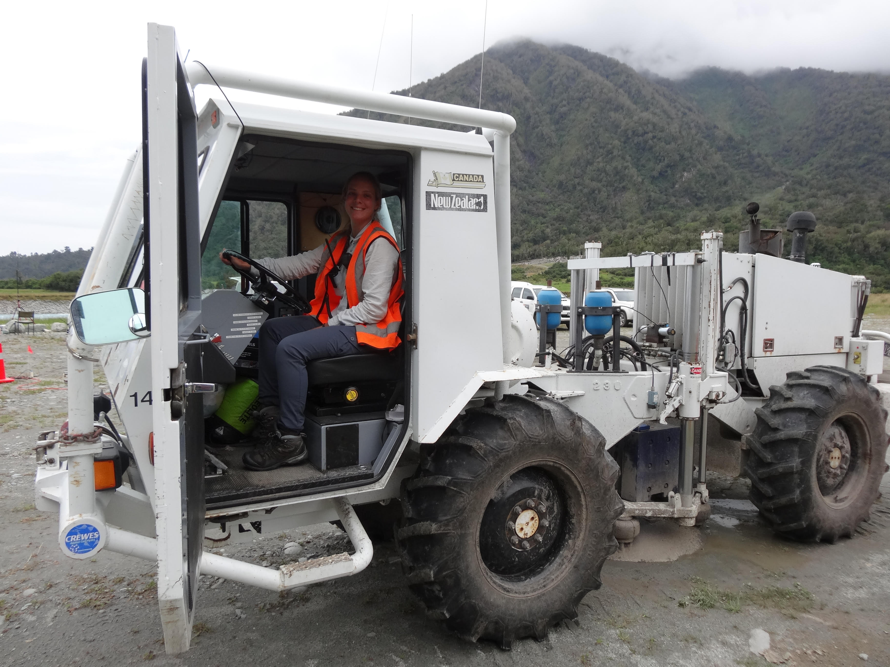
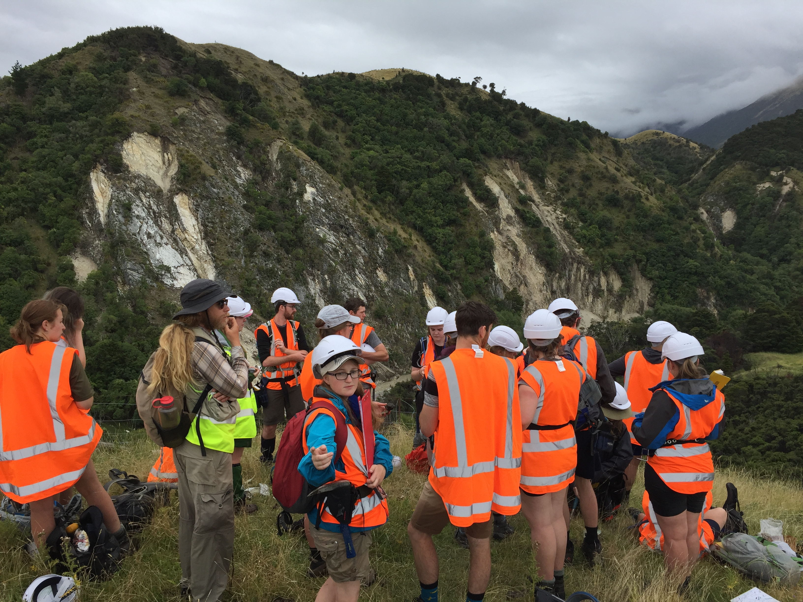
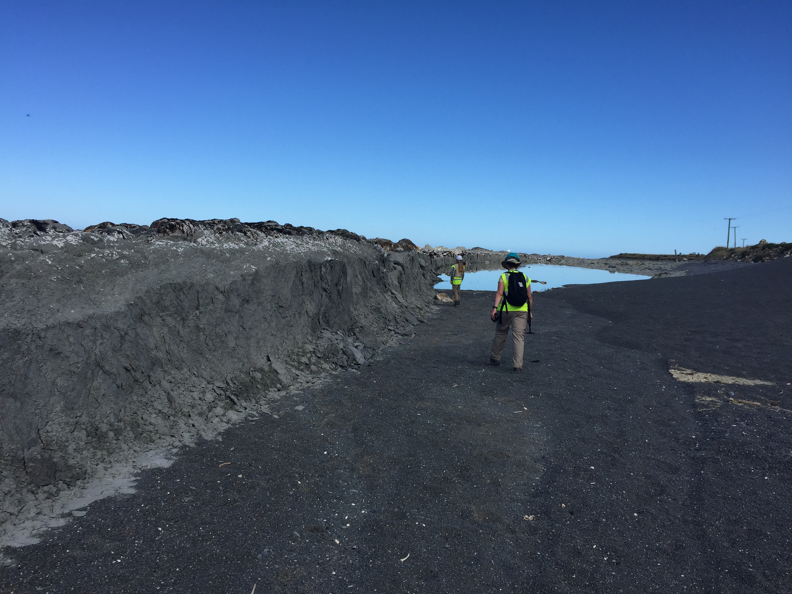
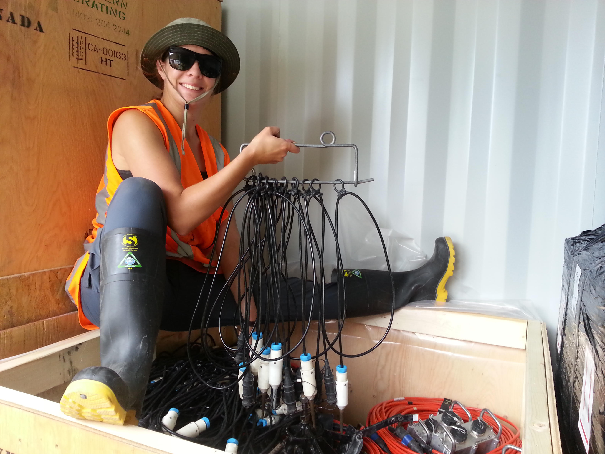
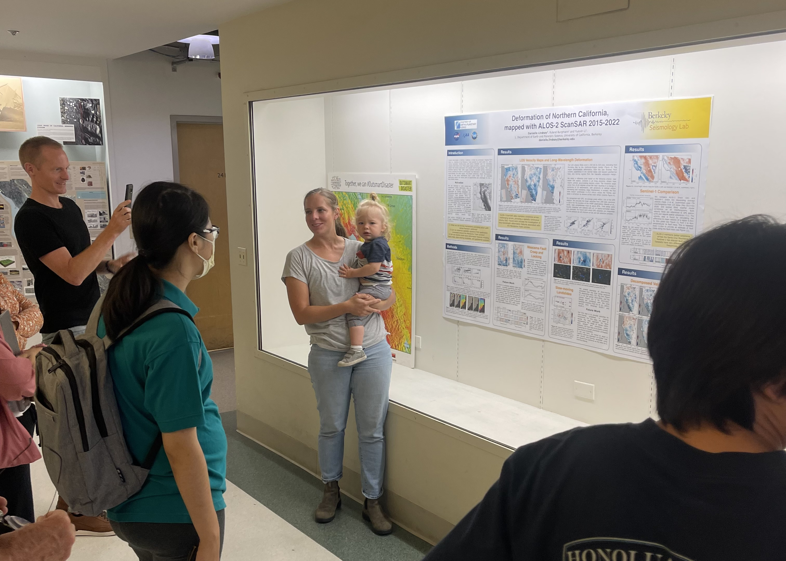
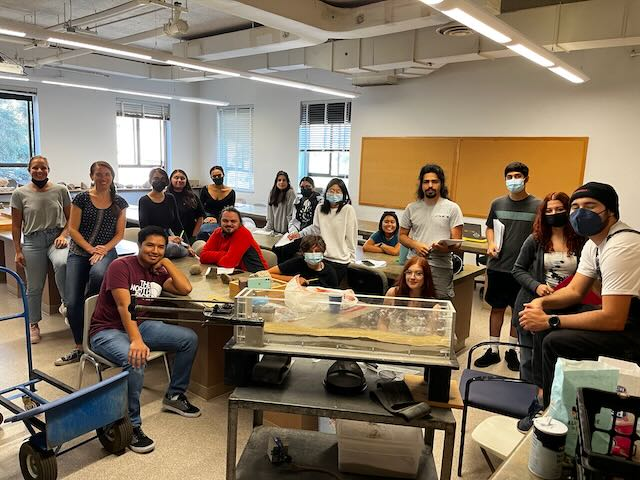
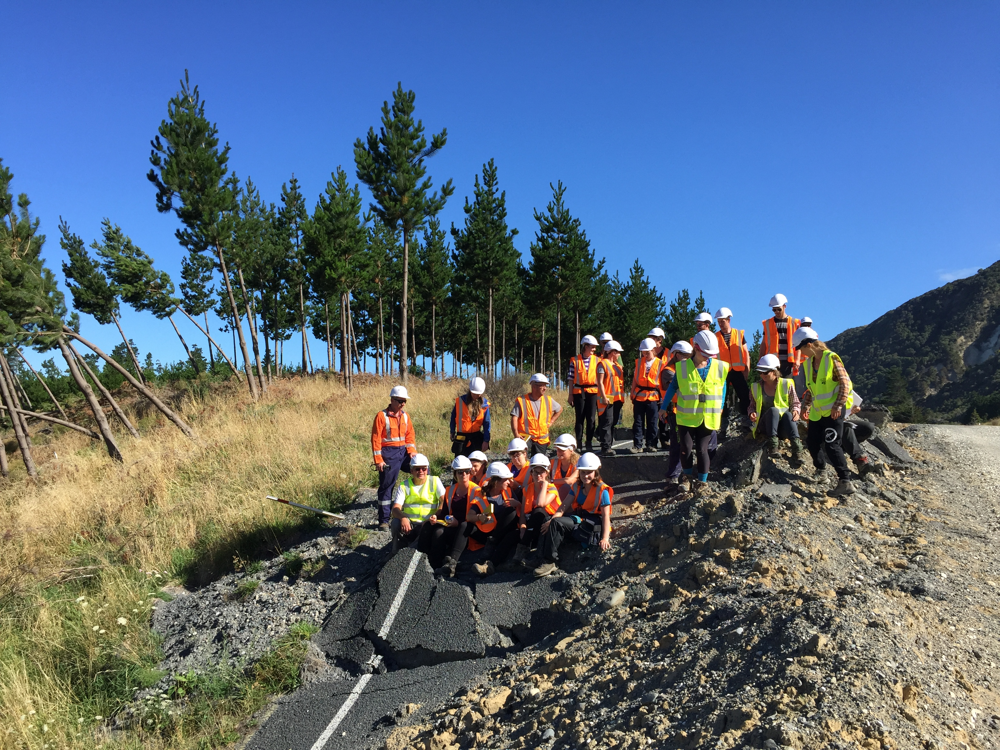

# InSAR Teaching Hub

I'm [Dani Lindsay](https://www.gns.cri.nz/about-us/staff-search/danielle-lindsay/) — an InSAR scientist at [ESNZ](https://www.gns.cri.nz/) in Wellington, working on landslides, faults, and volcanic systems across New Zealand. I built this hub for masters students who are starting to work with InSAR data: you probably know what an interferogram looks like from a paper, but you haven't yet made one yourself. This is not a course. The goal is to point you to the best resources that already exist, give you a path through them, and share the practical things I wish someone had told me earlier. → [More about me and my research](about.md)

This hub was assembled with the help of Claude (Anthropic), drawing on my thesis work, research notes, and guidance. Pages carry a review banner until I've checked them — treat flagged content as a useful starting point but verify anything before you cite or act on it.

  
  
  
  
  
  
  
  
  

!!! tip "Best place to start"
    Go straight to the **[Resources](resources.md)** page — the ASF storyboards there are the best freely available introduction to InSAR and should be your first stop.

---

## A suggested pathway

1. **[Resources](resources.md)** — start with the ASF storyboards, then the background reading
2. **[Getting Started](getting-started.md)** — what InSAR measures, how it works, and what to watch out for when interpreting data
3. **[Key Papers](literature/keystone-papers.md)** — the papers and algorithm developments that shaped the field
4. **[Single Interferogram](workflows/single-interferogram.md)** — order and explore your first interferogram using ASF OnDemand
5. **[Time Series](workflows/hyp3-mintpy.md)** — build a displacement time series with HyP3 products and MintPy

---

## About this hub

This resource is maintained by [Danielle Lindsay](https://www.gns.cri.nz/about-us/staff-search/danielle-lindsay/) and updated as new students come through. If something is broken or out of date, raise an issue on GitHub.

!!! note "Using these resources"
    Please credit the original authors of any tools, tutorials, or datasets you use. Attribution links are included throughout.
