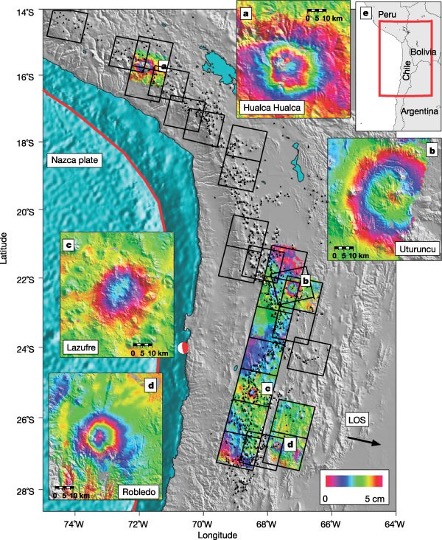

# Keystone InSAR Papers

!!! warning "Under review"
    This page was assembled by Claude (Anthropic) drawing on Dani Lindsay's thesis work, research notes, and guidance. It has not yet been through a final review — if you see this notice, treat the content as a useful starting point but verify anything you plan to cite or act on.

---

These are the papers that shaped the field — ones that any InSAR practitioner should be familiar with regardless of application area. The list is not exhaustive; it reflects the papers most relevant to geodetic applications in tectonics, slow-slip, and landslides.

---

| | Reference | Link | Key takeaway |
|---|-----------|------|--------------|
|  | Massonnet, D., Rossi, M., Carmona, C., Adragna, F., Peltzer, G., Feigl, K., & Rabaute, T. (1993). The displacement field of the Landers earthquake mapped by radar interferometry. *Nature*, 364(6433), 138–142. | [DOI](https://doi.org/10.1038/364138a0) | The paper that announced InSAR to the geophysics community — first full interferogram of an earthquake coseismic displacement field. |
| | Bürgmann, R., Rosen, P. A., & Fielding, E. J. (2000). Synthetic aperture radar interferometry to measure Earth's surface topography and its deformation. *Annual Review of Earth and Planetary Sciences*, 28, 169–209. | [DOI](https://doi.org/10.1146/annurev.earth.28.1.169) | The comprehensive review paper — start here for a thorough grounding in the physics and applications. |
| | Berardino, P., Fornaro, G., Lanari, R., & Sansosti, E. (2002). A new algorithm for surface deformation monitoring based on small baseline differential SAR interferograms. *IEEE Transactions on Geoscience and Remote Sensing*, 40(11), 2375–2383. | [DOI](https://doi.org/10.1109/TGRS.2002.803792) | The original SBAS paper — the algorithm family that MintPy and LiCSBAS are built on. |
|  | Pritchard, M. E., & Simons, M. (2002). A satellite geodetic survey of large-scale deformation of volcanic centres in the central Andes. *Nature*, 418(6894), 167–171. | [DOI](https://doi.org/10.1038/nature00872) | Landmark systematic survey demonstrating InSAR's power for detecting deformation across entire volcanic arcs — shows what is possible at regional scale. |
| | Wright, T. J., Parsons, B. E., & Lu, Z. (2004). Toward mapping surface deformation in three dimensions using InSAR. *Geophysical Research Letters*, 31. | [DOI](https://doi.org/10.1029/2003GL018827) | Framework for combining ascending and descending tracks to recover horizontal and vertical components of motion. |
| | Yunjun, Z., Fattahi, H., & Amelung, F. (2019). Small baseline InSAR time series analysis: Unwrapping error correction and noise reduction. *Computers & Geosciences*, 133, 104331. | [DOI](https://doi.org/10.1016/j.cageo.2019.104331) | The MintPy paper — describes the algorithm and validation behind the most widely-used open-source SBAS time series tool. |

---

!!! note "Adding to this table"
    Thumbnail images go in `docs/assets/`. For papers without a representative figure in the repo, leave the image cell empty — the table still renders cleanly.
