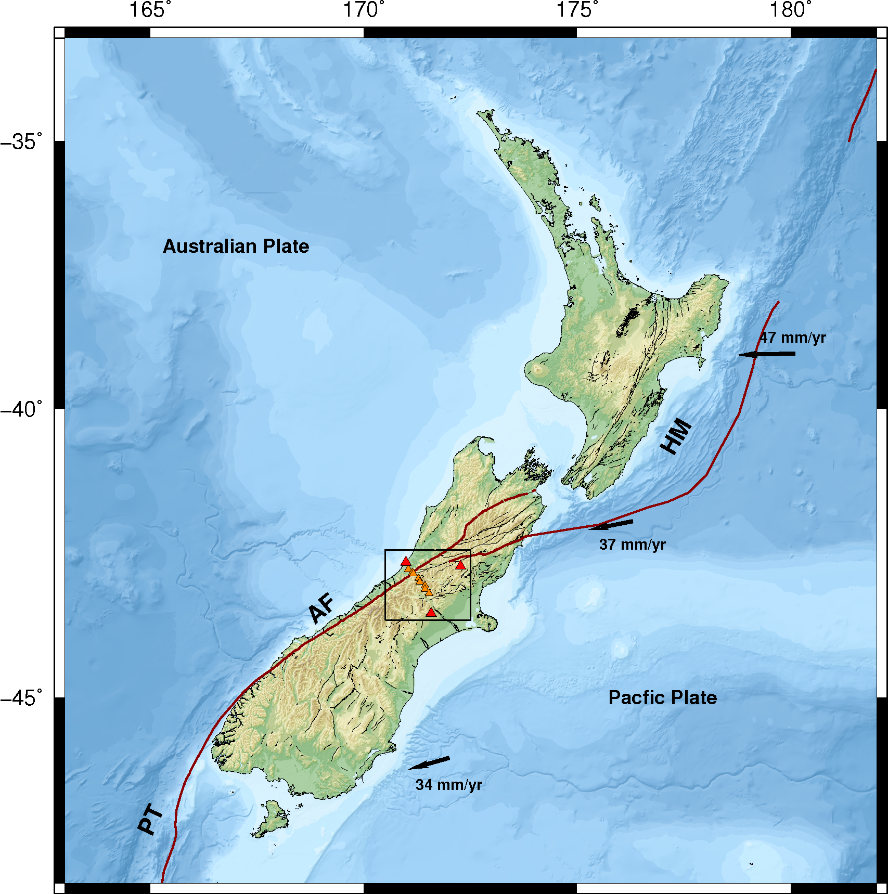

# New Zealand InSAR Papers

!!! warning "Under review"
    This page was assembled by Claude (Anthropic) drawing on Dani Lindsay's thesis work, research notes, and guidance. It has not yet been through a final review — if you see this notice, treat the content as a useful starting point but verify anything you plan to cite or act on.

---

InSAR studies focused on New Zealand — covering the Alpine Fault, North Island volcanic arc, Hikurangi subduction zone, and slow-moving landslides. This list is not exhaustive but covers the papers most relevant to ongoing work in NZ tectonic and hazard contexts.

   
  <em>New Zealand tectonic setting, showing the Alpine Fault (AF), Hikurangi margin (HM), and Puysegur Trench (PT) at the boundary between the Australian and Pacific plates. Plate convergence rates from NUVEL-1A.</em>

*Maintained by Danielle Lindsay. One-sentence takeaways are my own interpretations.*

---

| | Reference | Link | Takeaway |
|---|-----------|------|----------|
| | *Add paper* | | |

---

!!! note "How to add a paper"
    1. Add a thumbnail of a key figure to `docs/assets/` (keep filenames descriptive, e.g. `author_year_fig1.png`).
    2. Add a row to the table: thumbnail in the first cell, APA reference in the second, DOI link in the third, one-sentence takeaway in the fourth.
    3. Write the takeaway yourself — what does this paper tell you that is useful for NZ work specifically?
