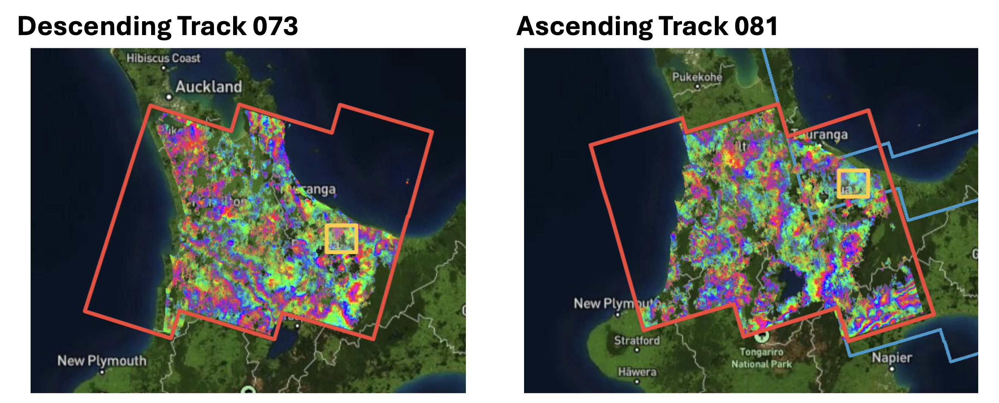
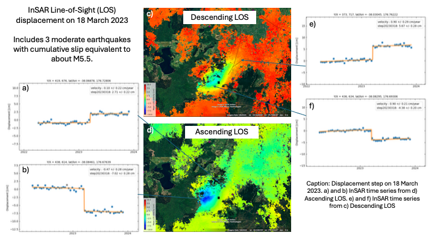
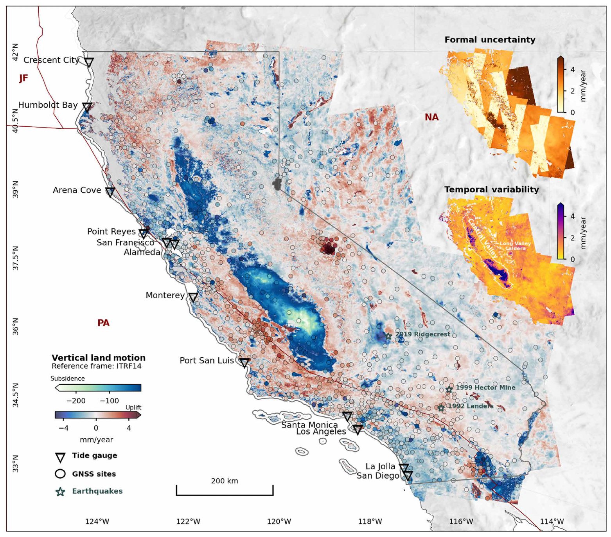

# Time Series (ARIA + MintPy)

!!! warning "Disclaimer"
    This page was assembled by Claude (Anthropic) drawing on Dani Lindsay's research notes and guidance. It has not yet been through a final review — treat the content as a useful starting point but verify anything you plan to cite or act on.

---

ARIA-S1-GUNW products are pre-processed Sentinel-1 interferograms produced by NASA's Jet Propulsion Laboratory and distributed freely through ASF. Unlike the HyP3 workflow where you order and wait for processing, the ARIA archive already exists — you download what you need and feed it straight into MintPy.

The full Sentinel-1 archive for all of New Zealand has been processed into ARIA products, covering all available acquisitions from 2015 through September 2025. Some tracks and frames had irregular early acquisitions before routine Sentinel-1 operations were established, so effective coverage varies by location, but for most of New Zealand you have a near-decade time series to work with. The example below uses Kawerau (Descending Track 073, Ascending Track 081), but the same workflow applies anywhere in the country.

<p align="center">
  <br>
  <em>ARIA-S1-GUNW coverage for Descending Track 073 and Ascending Track 081 over the North Island. The orange boxes show the full track footprint; the yellow box marks the Kawerau target area.</em>
</p>

---

## Strengths and limitations

**Strengths:**

- No ordering or processing wait — the archive is there, you download the bbox you need
- Products are validated and consistent across the whole archive
- No temporal smoothing applied, so transient and stepwise deformation (earthquakes, slow slip events, seasonal signals) are preserved in the time series
- You can order additional pairs (outside the archive date range or custom pair lists) via ASF on-demand and they are added to the public archive once processed
- 90 m pixel spacing — similar to the planned NISAR GSLC product (~80 m), so this is good practice for NISAR workflows

**Limitations:**

- Fixed spatial resolution and filtering — you cannot change multi-looking or filter parameters
- Pairs are pre-defined SBAS-style short temporal baselines; you cannot generate bespoke long-baseline pairs
- Landslides are a tricky target — 90 m pixel spacing sets the minimum resolvable feature size, which rules out smaller slides but is adequate for large, slow-moving ones
- **Data gaps in the NZ archive**: some tracks have a gap in acquisitions (typically in the 2021–2022 period for some NZ frames) that breaks network connectivity. Where this occurs you cannot invert a single connected time series spanning the full archive — you will need to treat the pre- and post-gap periods as two separate time series. Check the coherence history plots in `ariaTSsetup.py` output before assuming continuous coverage

**Sign convention — read this:** ARIA unwrapped interferograms have the **opposite sign** from HyP3/GAMMA products. In ARIA products the more recent acquisition is the reference (not the secondary), so positive values indicate motion **toward** the sensor and negative values indicate motion **away from** the sensor. This is the reverse of what you are used to from HyP3. MintPy handles this correctly internally, but it will trip you up if you compare velocity maps from the two workflows directly without checking.

---

## Phase closure bias — a NZ-specific warning

New Zealand is mostly vegetated, and the ARIA archive uses short neighbouring pairs (6–12 day repeat). In vegetated terrain, decorrelation between acquisitions introduces a systematic bias in the wrapped phase that does not cancel when interferograms are combined into a time series. This is called **phase closure bias** (or non-closure bias).

The symptom is a consistent apparent offset between urban areas (which have high coherence and little bias) and surrounding vegetated areas (which decorrelate and accumulate bias). It can look like all the cities are sinking relative to the countryside — but it is an artefact, not real motion.

If you see a pattern where urban pixels are consistently offset from rural pixels across your whole scene with no obvious structural reason, treat it with suspicion. Phase closure bias is a known issue in the ARIA/SBAS literature and is particularly prominent in datasets that rely heavily on short-baseline pairs over low-coherence terrain. See Yunjun et al. (2019) — the MintPy paper — for discussion of closure phase correction approaches.

---

## Example: 2023 Kawerau seismic swarm

These data were used to detect and measure coseismic displacement from the March 2023 Kawerau earthquake swarm (3 moderate earthquakes, cumulative moment equivalent to ~M5.5). Both ascending and descending tracks show a clear step at 2023-03-18, with maximum LOS displacement of ~9 cm in both geometries. For full seismological and structural context see Marck et al. (*in prep*).

<p align="center">
  <br>
  <em>Displacement step at 2023-03-18 from the Kawerau seismic swarm, measured in descending (Track 073) and ascending (Track 081) line-of-sight. Time series at selected pixels show the clean coseismic step with negligible pre- and post-seismic velocity.</em>
</p>

This is a good example of what ARIA products are well-suited for: a localised, moderate-to-large deformation signal where the 90 m resolution is sufficient and the pre-existing archive means you can start analysing immediately after an event.

---

## Workflow

### 1. Install ARIA-tools

```bash
conda create -n aria_env python=3.10
conda activate aria_env
conda install -c conda-forge gdal shapely
pip install ARIAtools
```

You need **version 3.0.1 or later** to get all the required product layers for MintPy preparation.

---

### 2. Download products

```bash
ariaDownload.py \
  -b '-38.37 -37.63 176.13 177.20' \
  --track 73
```

The bounding box here (`-b 'S N W E'`) is set to a ~25 km radius around the Kawerau deformation signal, large enough to include GPS stations for referencing. Adjust for your target.

To download ascending Track 081, change `--track 73` to `--track 81`.

!!! note
    Products download to a `products/` subdirectory. Each `.nc` file is one interferometric pair. Expect ~170 GB for a full track archive — download only the date range you need for a first pass.

---

### 3. Prepare for MintPy

`ariaTSsetup.py` reads the ARIA `.nc` files and writes the HDF5 stacks that MintPy expects.

```bash
# First pass — more conservative coherence threshold
ariaTSsetup.py \
  -f 'products/*.nc' \
  -d Download \
  --mask Download \
  -nt 30 \
  -l 'all' \
  --bbox '-38.3563 -37.7192 176.1649 177.0600' \
  -mo 2000

# Second pass — looser threshold to recover more pixels if needed
ariaTSsetup.py \
  -f 'products/*.nc' \
  -d Download \
  --mask Download \
  -nt 30 \
  -l 'all' \
  --bbox '-38.3563 -37.7192 176.1649 177.0600' \
  -mo 4000
```

`-nt` is the number of threads. `-mo` is the minimum overlap threshold for stitching frames — try 2000 first, increase to 4000 if spatial coverage is poor.

---

### 4. MintPy time series

From here the workflow is standard MintPy. A few things specific to ARIA inputs:

**Reference the MintPy ARIA tutorial:**  
[https://github.com/insarlab/MintPy-tutorial](https://github.com/insarlab/MintPy-tutorial) — there is a dedicated ARIA notebook.

**Template file:** use `smallbaselineApp.cfg` as normal. Point `mintpy.load.processor` to `aria`.

**Fitting a coseismic step:**

```bash
timeseries2velocity.py ./timeseries_tropHgt_demErr.h5 \
  --step 20230318 \
  -o velocity_w_step.h5
```

The date after `--step` should be the first acquisition *after* the event — i.e., the date by which all displacement has occurred within the 12-day sampling window.

**Viewing the step:**

```bash
view.py ./velocity_w_step.h5 step20230318 \
  --save --zm \
  --sub-lat -38.27 -37.89 \
  --sub-lon 176.50 176.98 \
  -o step20230318_map.png
```

---

### 5. Combining ascending and descending

Once you have velocity (or step) maps from both tracks, you can decompose into approximate horizontal (east-west) and vertical components. The tracks need to be in the same spatial reference frame first — subset to your common area, then:

```bash
asc_desc2horz_vert.py \
  sub_T073_velocity.h5 \
  sub_T081_velocity.h5 \
  --max-ref-yx-diff 200
```

`--max-ref-yx-diff` sets the tolerance (in pixels) for matching the reference point locations between tracks. Increase if the two tracks used different reference pixels.

---

## A notable application

Govorcin et al. (2025) used the full California ARIA archive — 61,451 GUNW products across nine tracks — to produce a state-wide vertical land motion (VLM) map at 90 m resolution and quantify its contribution to relative sea-level rise projections. The study shows that regional sea-level projections can underestimate local rise by more than a factor of two in areas with localised subsidence (e.g., San Francisco Bay, Los Angeles), and that temporally variable VLM driven by groundwater and hydrocarbon extraction can increase 2050 projection uncertainty by up to 0.4 m in some areas. It is a compelling demonstration of what you can do with the full ARIA archive at scale, and the methods are directly applicable to NZ coastal subsidence and uplift questions.

<p align="center">
  <br>
  <em>Figure 1 from Govorcin et al. (2025): VLM (mm/year) for 2015–2023 estimated from Sentinel-1 ARIA products combined with GNSS, relative to ITRF2014. Negative values reflect subsidence; positive values reflect uplift. Published under CC BY 4.0.</em>
</p>

> Govorcin, M., Bekaert, D. P., Hamlington, B. D., Sangha, S. S., & Sweet, W. (2025). Variable vertical land motion and its impacts on sea level rise projections. *Science Advances*, 11(5), eads8163. [https://doi.org/10.1126/sciadv.ads8163](https://doi.org/10.1126/sciadv.ads8163)

---

## Key references

| Tool / Product | Reference |
|----------------|-----------|
| ARIA-S1-GUNW products | Bekaert, D. P. S., et al. (2023). *ARIA Sentinel-1 Geocoded Unwrapped Interferograms (GUNW)*. NASA Alaska Satellite Facility DAAC. [https://doi.org/10.5067/1VIKGRF0ARUF](https://doi.org/10.5067/1VIKGRF0ARUF) |
| ARIA-tools | Buzzanga et al. (2020); [github.com/aria-tools/ARIA-tools](https://github.com/aria-tools/ARIA-tools) |
| MintPy | Yunjun, Fattahi & Amelung (2019); [github.com/insarlab/MintPy](https://github.com/insarlab/MintPy) |
| GNU Parallel (used in download) | Tange (2025). Zenodo. [https://doi.org/10.5281/zenodo.17692695](https://doi.org/10.5281/zenodo.17692695) |
| Kawerau seismic swarm | Marck, A., Illsley-Kemp, F., Hreinsdóttir, S., Lindsay, D., Villamor, P., & Hart, R. (*in prep*). Swarm activity at the boundary between magmatic and tectonic rift segments: The March 2023 Kawerau seismic swarm (Ōkataina, North Island, New Zealand). |

---

## Acknowledgements

This workflow makes use of MintPy (Yunjun et al., 2019), available at [github.com/insarlab/MintPy](https://github.com/insarlab/MintPy). ARIA-S1-GUNW products were obtained from the NASA Alaska Satellite Facility DAAC (Bekaert et al., 2023).

> Yunjun, Z., Fattahi, H., & Amelung, F. (2019). Small baseline InSAR time series analysis: Unwrapping error correction and noise reduction. *Computers & Geosciences*, 133, 104331. [https://doi.org/10.1016/j.cageo.2019.104331](https://doi.org/10.1016/j.cageo.2019.104331)

> Bekaert, D. P. S., et al. (2023). *ARIA Sentinel-1 Geocoded Unwrapped Interferograms (GUNW)*. NASA Alaska Satellite Facility DAAC. [https://doi.org/10.5067/1VIKGRF0ARUF](https://doi.org/10.5067/1VIKGRF0ARUF)
