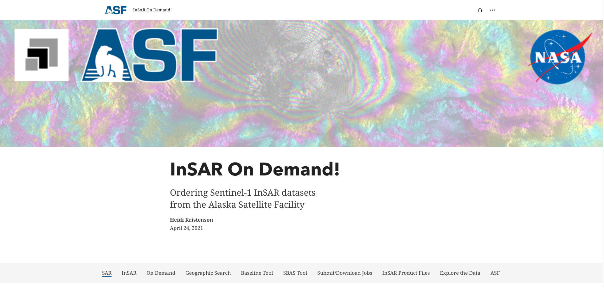
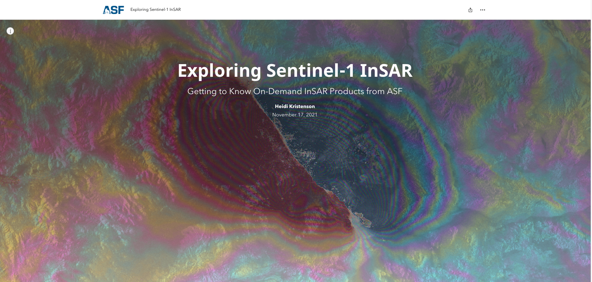
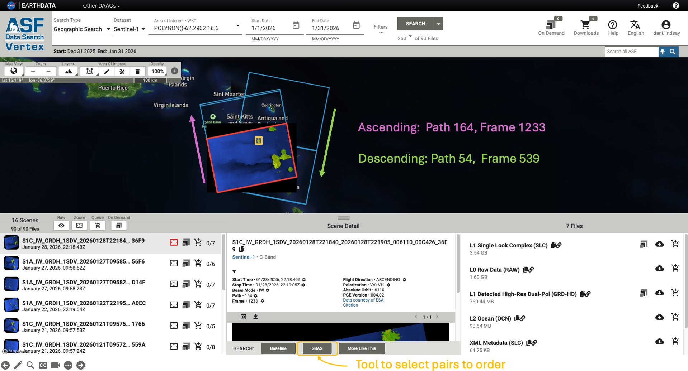
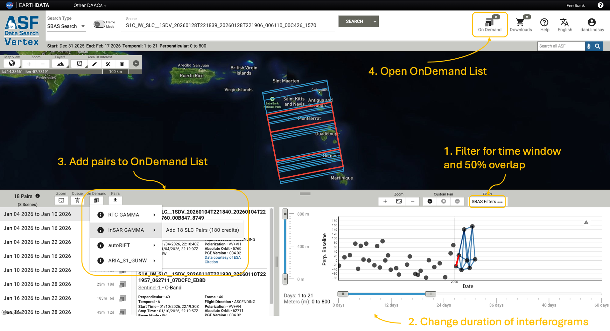
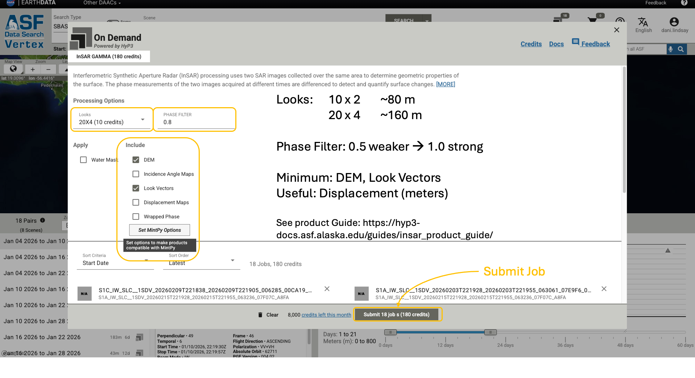
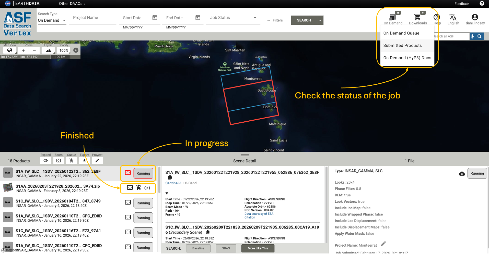
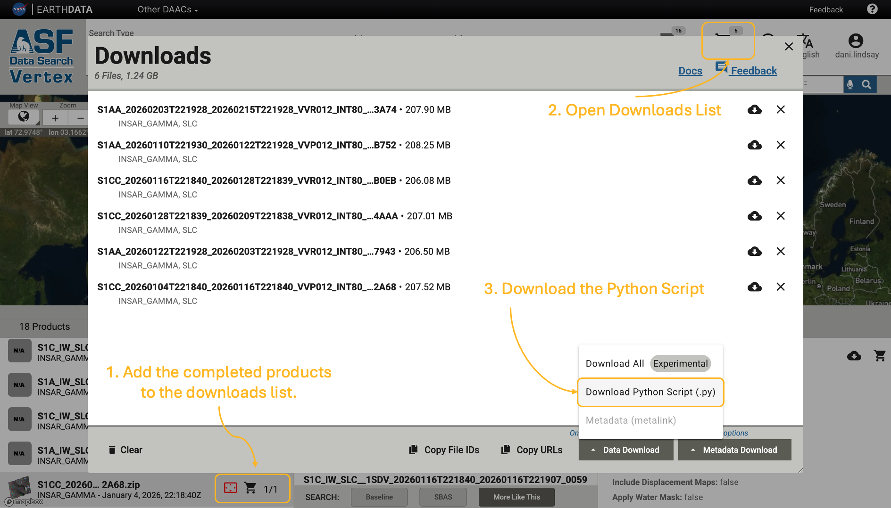
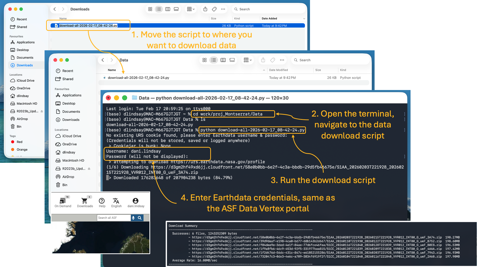
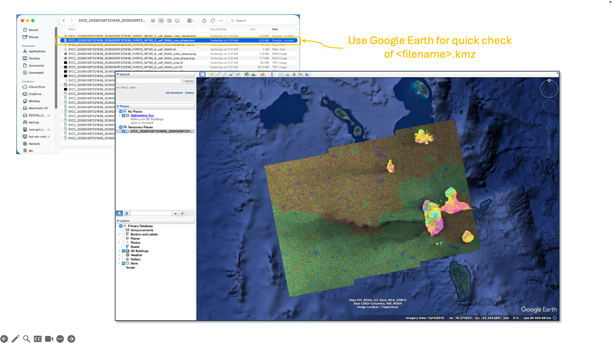
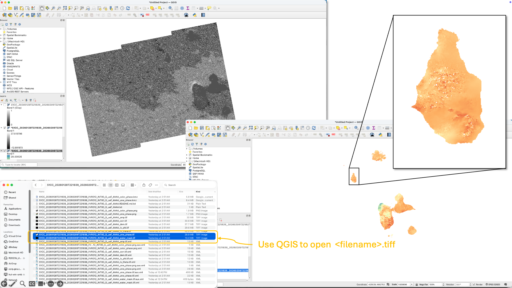

# Ordering Your First Interferogram (ASF OnDemand)

This workflow walks you through ordering a single Sentinel-1 interferogram using the Alaska Satellite Facility's ([ASF](https://asf.alaska.edu/)) on-demand processing service, exploring the products, and doing a first-pass interpretation.

**Background**

The Sentinel-1 constellation (satellites A and C) collects SAR images every 6–12 days in each orbit direction. A quick and simple way to generate an interferogram is to use ASF's Hybrid Pluggable Processing Pipeline, or [HyP3](https://hyp3-docs.asf.alaska.edu/about/) (pronounced "hype") — a cloud-native processing platform that processes SAR imagery using [GAMMA](https://www.gamma-rs.ch/gamma-software) software.

!!! tip "Pros and cons of this approach"
    **Pros:** Interferograms available within ~24 hours of a SAR acquisition. No local SAR processing software required.  
    **Cons:** Processes the whole Sentinel-1 frame, which is a larger area than you may need. Frame boundaries shift slightly over time, so your geographic target is not always fully covered.

---

## Step 1 — Follow the ASF training storyboards

Before ordering anything, work through these two storyboards. They are well-made and cover the key concepts clearly.

**1. InSAR On Demand!**  
Learn how to navigate ASF Vertex and order interferograms online. Detailed descriptions of processing parameters are in the [Sentinel-1 InSAR Product Guide](https://hyp3-docs.asf.alaska.edu/guides/insar_product_guide/).

   
  <em>ASF Storyboard: ordering interferograms using HyP3 On-Demand.</em>

**2. Exploring Sentinel-1 InSAR**  
Steps through each output data layer using the 2019 Ridgecrest Earthquake as an example. The example dataset is available at the bottom of the storyboard so you can download and follow along.

   
  <em>ASF Storyboard: exploring Sentinel-1 HyP3 products.</em>

!!! note
    The Ridgecrest example is a well-behaved dataset — clear fringes, good coherence, simple geometry. Most real-world targets are messier. Work through this example first so you understand what "good" data looks like.

---

## Step 2 — Order an interferogram for your area

> These screenshots show the ordering steps. Follow the storyboard above for full instructions; this is a quick reference.

**1–2. Select your area and time window of interest.**

   
  <em>Search for Sentinel-1 data on ASF Data Vertex and select your area of interest.</em>

**3–4. Use the SBAS tool to select image pairs, then add to the On-Demand queue.**

   
  <em>Select interferogram pairs using the SBAS baseline tool.</em>

**5–6. Set processing parameters and submit.**  
See the [product guide](https://hyp3-docs.asf.alaska.edu/guides/insar_product_guide/) for detailed parameter descriptions.

   
  <em>Submit the HyP3 processing job. Processing typically takes a few hours.</em>

**7. Check job status.**

   
  <em>Monitor job progress in the HyP3 status page.</em>

---

## Step 3 — Download products

Add completed products to your download list and grab the Python download script.

   
  <em>Select finished products to download.</em>

Move the download script to your data directory, open a terminal there, and run it. You will be prompted for your ASF credentials (same login as Data Vertex).

   
  <em>Run the download script from your target directory.</em>

---

## Step 4 — Explore and interpret

### Viewing the data

   
  <em>View .kmz files in Google Earth — quick visual check.</em>

   
  <em>View .tif files in QGIS — useful for overlaying other datasets.</em>

### What to look for

- **Concentric fringes** → inflation/deflation or earthquake deformation
- **Linear gradients** → tectonic strain or atmospheric ramp
- **Loss of coherence** → vegetation change, landslide, snow cover, or new deposits

!!! tip "Reading an interferogram"
    EarthScope (UNAVCO) have a useful one-page guide:  
    [How to read an interferogram — Wolf Volcano, Galápagos](https://www.unavco.org/education/outreach/infographics/lib/images/InSAR-Basics-front.pdf)

### A classic example

For inspiration, here is Figure 1 from Pritchard & Simons (2002) — one of the landmark InSAR papers showing volcanic deformation detected across the Central Andes.

   
  <em>Figure 1 from Pritchard & Simons (2002). Interferometric colour fringes draped over topography show surface displacement in the radar line-of-sight direction. Each full colour cycle represents ~5 cm of motion. Circular fringe patterns highlight inflating and deflating volcanic centres.</em>

---

## Next steps

If you want to go beyond a single interferogram and build a displacement time series, see:

- **[HyP3 + MintPy time series](hyp3-mintpy.md)** — uses the same HyP3 products you have just downloaded
- **[LiCSAR + LiCSBAS](licsar-licsbas.md)** — pre-processed Sentinel-1 stacks from COMET, good for tectonic and volcanic regions worldwide

---

## Acknowledgement

When using HyP3 products in reports, presentations, or publications:

> Hogenson, K., Kristenson, H., Kennedy, J., Johnston, A., Rine, J., Logan, T., Zhu, J., Williams, F., Herrmann, J., Smale, J., & Meyer, F. (2020). *Hybrid Pluggable Processing Pipeline (HyP3): A cloud-native infrastructure for generic processing of SAR data* [Computer software]. https://doi.org/10.5281/zenodo.4646138

See [How to Cite HyP3 Products](https://hyp3-docs.asf.alaska.edu/usage_guidelines/).
