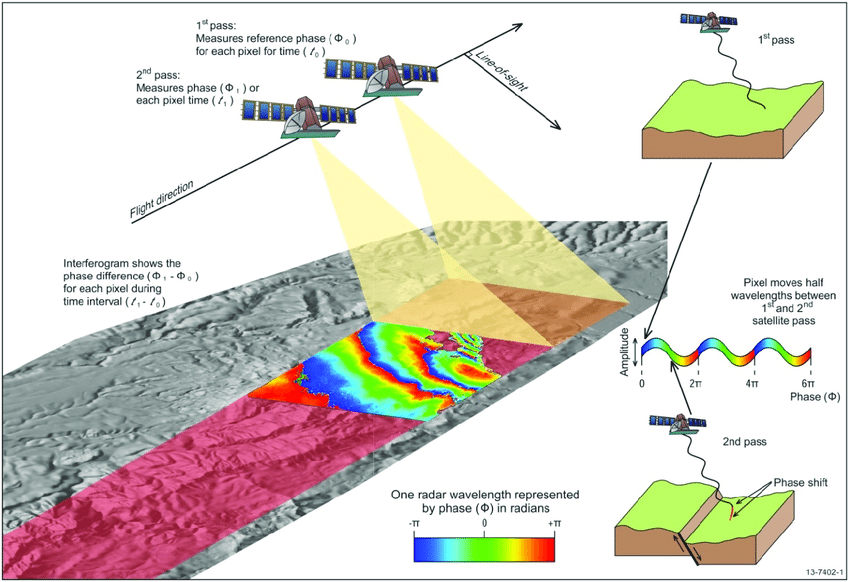

# InSAR basics (for volcano monitoring)

This page contains resources to learn about InSAR **theory** and **interferogram interpretation** for people with a geology/seismology background. Many organisations have already generated great learning tools, enjoy exploring! 

---

## What is InSAR?

**Interferometric Synthetic Aperture Radar (InSAR)** is a satellite-based remote sensing technique used to map ground deformation. It is particularly useful for monitoring volcanoes, earthquakes, landslides, and subsidence because it can detect surface motion at centimeter- to millimeter-scale resolution.

   
  <em>Conceptual overview of SAR acquisition geometry and radar line-of-sight. *[citation!!!]* </em>

---

## How InSAR Works

The technique uses two or more **Synthetic Aperture Radar (SAR)** images of the Earth's surface, collected by orbiting satellites at different times from the same vantge point, to measure changes in ground height.

### Key concepts

- **Two Passes:** A satellite passes over the same area at least twice.  
- **Microwave Signals:** A pulse of microwave energy, that propogates through cloud-cover, is sent out and the returned signal is measured.  
- **Phase Measurement:** Each pass measures the phase ($\Phi$) of the radar signal reflected from the ground for every pixel.  
- **Interferogram:** An interferogram is generated by comparing the phase difference ($\Phi_1 - \Phi_2$) between the two passes over a time interval ($t_1 - t_2$).  
- **Deformation Detection:** If the ground surface moves between acquisitions (e.g., magma migration or subsurface pressure changes), the satellite-to-ground distance changes, producing a phase shift. This shift appears as colorful **fringes** in the interferogram, where one full color cycle (−π to +π radians) represents motion of **half a radar wavelength** along the satellite line-of-sight.
- **Horizontal and Vertical Motion:** InSAR does not measure vertical motion directly — it measures change in distance between the satellite and the ground (line-of-sight). Once the same scene is observed by the ascending (south-to-noth) and descending (north-to-south) passes, we can solve for horizontal and vertical motion.

## Why it matters for volcano monitoring

InSAR has revolutionized volcanology by providing dense geodetic observations across entire volcanic systems, including remote or hazardous regions where ground instrumentation is limited.

It enables scientists to:

- Detect volcanic unrest  *[example citation]*
- Measure uplift and subsidence  *[example citation]*
- Track magma chamber inflation/deflation  *[example citation]*
- Map eruptive deposits (e.g., lava flows, ashfall)  *[example citation]*
- Monitor deformation through time  *[example citation]*

**Rule of thumb for interpretation**

- Same volcano inflation can look different on ascending vs descending tracks.  
- A single interferogram view can’t uniquely separate vertical vs horizontal motion.
- Utilize time series analysis of deformation to monitor gradual changes over months and years .   

---

## The 5 biggest “gotchas” (volcano edition)

Use this as a checklist before interpreting any pattern.

1. **Atmosphere** can mimic deformation (patchy, correlated with topography, changes between dates).   *[example citation]*
2. **Unwrapping errors** can create false bullseyes or discontinuities.   *[example citation]*
3. **Topography + geometry** cause layover/shadow (missing data, odd edges).   *[example citation]*
4. **One interferogram ≠ 3D motion** (you often need ascending + descending, or GNSS, or modeling).   *[example citation]*
5. **Low coherence** does **not** mean no deformation — it means the phase signal is unreliable.   *[example citation]*

> [!WARNING]
> Many “perfect volcano bullseyes” in beginner studies turn out to be atmosphere or unwrapping artifacts.

---

## Learning pathway (engaging + low barrier)

**Intro to SAR and InSAR**  
- ASF Introduction to SAR 
https://hyp3-docs.asf.alaska.edu/guides/introduction_to_sar/

- USGS Fact Sheet: Monitoring Ground Deformation from Space - Three Sisters Volcano & Akutan Volcano.
  https://pubs.usgs.gov/fs/2005/3025/2005-3025.pdf  

- EarthScope (UNAVCO) How to read an interferogram - Wolf Volcano, Galápagos Islands, Ecuador
https://www.unavco.org/education/outreach/infographics/lib/images/InSAR-Basics-front.pdf?

- NASA Earthdata “Synthetic Aperture Radar (SAR)” overview (clear, non-mathy).  
https://www.earthdata.nasa.gov/learn/earth-observation-data-basics/sar

- Simons M., and Rosen P.A Interferometric Synthetic Aperture Radar Geodesy. In:
Gerald Schubert (editor-in-chief) Treatise on Geophysics, 2nd edition, Vol 3. Oxford:
Elsevier; 2015. p. 339-385. 
https://simons.caltech.edu/publications/pdfs/Simons_etal_2015.pdf

- ASF Sentinel-1 InSAR Product Guide
https://hyp3-docs.asf.alaska.edu/guides/insar_product_guide/ 

**ASF Storyboards**
- ASF provide VERY good story boards for introducing various InSAR concepts and products, found here: https://asf-daac.maps.arcgis.com/home/index.html

---

### Optional: Short-course materials

***EarthScope Short Courses***
- Earthscope offer remote and inperson InSAR processing courses: https://www.earthscope.org/education/skill-building-learning/courses/
- 2025 course recordings are available: https://www.youtube.com/playlist?list=PLGQwSTwiUcKyFTPhELEVOjqzq9rPUJM1f
- 2025 course notebooks and materials: https://github.com/isceplus/2025-isceplus

---

## Quick self-check

1. What direction does InSAR measure motion in?  
2. Name two reasons coherence drops in vegetated areas.  
3. How can atmosphere look different from true deformation?  
4. Why can a single interferogram be misleading for volcano inflation?  
5. What extra data helps separate vertical vs horizontal motion?

<b>Answers</b>

1. Line-of-sight (satellite-to-ground distance).  
2. Vegetation change, moisture change, time gap, viewing geometry changes.  
3. Patchy signals, correlated with topography/weather.  
4. Atmosphere, unwrapping, LOS mixing, reference choice.  
5. Asc+desc tracks, GNSS, modeling, time series.

---

## References 

### Classic Review Papers 

- **InSAR Overview:** Bürgmann, R., Rosen, P. A., & Fielding, E. J. (2000). Synthetic aperture radar interferometry to measure Earth’s surface topography and its deformation. Annual review of earth and planetary sciences, 28(1), 169-209. 
- **InSAR SBAS Timeseries:** Schmidt, D. A., & Bürgmann, R. (2003). Time‐dependent land uplift and subsidence in the Santa Clara valley, California, from a large interferometric synthetic aperture radar data set. Journal of Geophysical Research: Solid Earth, 108(B9).
- **From LOS to 3D motion:** Wright, T. J., Parsons, B. E., & Lu, Z. (2004). Toward mapping surface deformation in three dimensions using InSAR. Geophysical Research Letters, 31(1).
- **First interferogram of an earthquake!!** Massonnet, D., Rossi, M., Carmona, C., Adragna, F., Peltzer, G., Feigl, K., & Rabaute, T. (1993). The displacement field of the Landers earthquake mapped by radar interferometry. nature, 364(6433), 138-142. 
- **Volcanic activity across Central Andes** Pritchard, M. E., & Simons, M. (2002). A satellite geodetic survey of large-scale deformation of volcanic centres in the central Andes. Nature, 418(6894), 167-171.

### Useful Papers for Volcano-Geodesy
- **Atmosphere Errors** 

- **Ionosphere Errors**

- **Phase Bias Errors**

- **Overview of InSAR time series** Osmanoğlu, B., Sunar, F., Wdowinski, S., & Cabral-Cano, E. (2016). Time series analysis of InSAR data: Methods and trends. Isprs hjournal of photogrammetry and remote sensing, 115, 90-102.

- **SBAS with MintPy Tool** Yunjun, Z., Fattahi, H., & Amelung, F. (2019). Small baseline InSAR time series analysis: Unwrapping error correction and noise reduction. Computers & Geosciences, 133, 104331.

### Volcano InSAR Case Studies from around the world

Resources Compiled in Feb 2026.