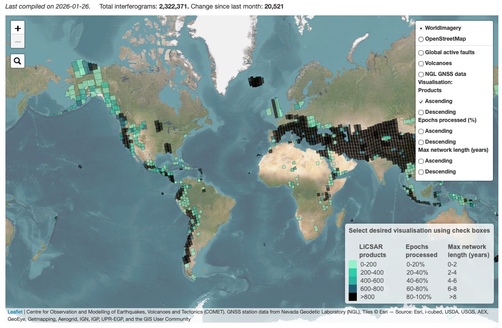
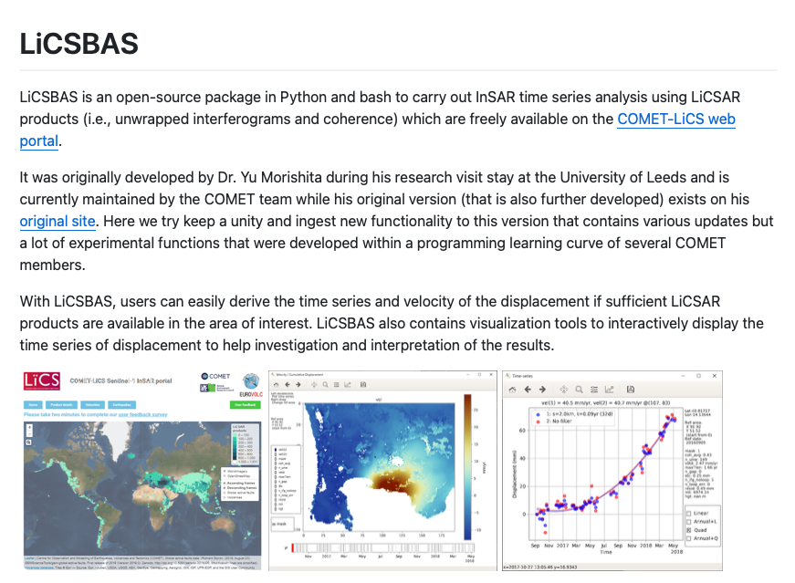
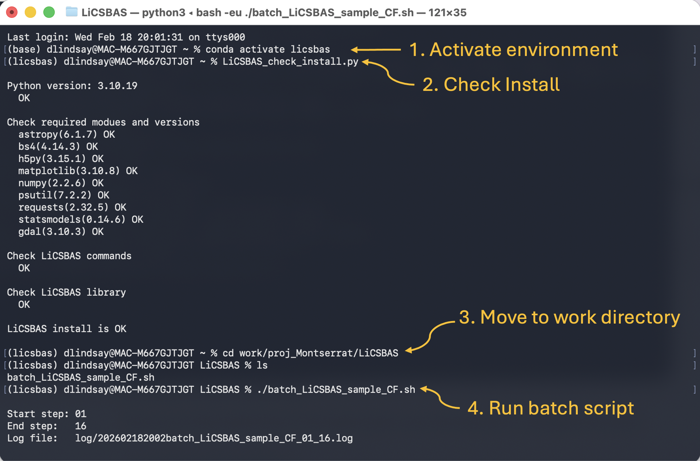
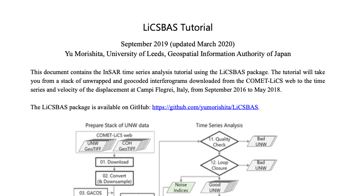

# Update Long-Term Deformation

This workflow updates existing deformation time series.

Used for:

* Routine monitoring
* Monthly/quarterly updates
* Background deformation tracking

<p align="center">
  <br>
  <em>COMET-LiCS: Sentinel-1 InSAR Portal. </em>
</p>

**Background**  
To monitor deformation through time, we use many interferograms to generate displacement time series. Calcuating time series improves signal-to-noise and allows us to resolve subtle deformation signals that evolve slowly — such as gradual inflation, subsidence, or creep — over periods of weeks to years.

A primary data source for this workflow is the automated processing system developed by the **Centre for the Observation and Modelling of Earthquakes, Volcanoes and Tectonics ([COMET](https://comet.nerc.ac.uk/))**, based at the **University of Leeds**. COMET produces Sentinel-1 interferograms for volcanic and tectonic regions worldwide — including the Eastern Caribbean.

These interferograms are distributed through the **LiCSAR** processing system and can be accessed via the LiCS Portal: https://comet.nerc.ac.uk/COMET-LiCS-portal/

LiCSAR products are pre-processed using the **[GAMMA](https://www.gamma-rs.ch/gamma-software) SAR software** suite and delivered in a consistent geographic reference frame. This makes them well suited for time-series analysis without requiring users to perform full interferometric processing themselves.

For time-series generation, LiCSAR products integrate directly with **LiCSBAS** (LiCSAR Baseline Analysis Software), an open-source toolkit for constructing displacement time series, velocity maps, and quality metrics from LiCSAR interferogram stacks: https://github.com/comet-licsar/LiCSBAS

This provides a simple, low-effort pathway to generate long-term deformation products for monitoring and reporting purposes.

***Pro's*** Fixed frame, already cropped so only getting data over geographic target

***Con's*** Data process ~quartlery so there is a delay between the data being aquired and being able to update deformation time series. 

<p align="center">
  <br>
  <em>LiCSBAS Python and bash tool to carry out InSAR time series analysis with LiCSAR products. </em>
</p>

---

## LiCSBAS Installation (Ubuntu Linux)

These instructions install LiCSBAS using a Conda environment.

This is the recommended method as it installs all dependencies automatically.

### 1. Install Miniconda
> [!WARNING]
> You only need to do this once, check if you already have it installed. If yes, skip to step 3.  

```bash
conda --version
```

Download the installer:

```bash
mkdir -p /path/to/folder/tools; cd /path/to/folder/tools

# This is the specific installer for linux machines
wget https://repo.anaconda.com/miniconda/Miniconda3-latest-Linux-x86_64.sh
```
Here is the [Getting started with Anaconda](https://www.anaconda.com/docs/getting-started/main) info if you want to know more about conda. 


Run the installer and follow the prompts:

```bash
bash Miniconda3-latest-Linux-x86_64.sh
```

### 2. Restart Terminal

Close the terminal and reopen it, or run:

```bash
source ~/.bashrc
```

Check Conda installed:

```bash
conda --version
```

### 3. Download LiCSBAS

Change to your tools directory and clone the github repo for LiCSBAS. 

```bash
cd /path/to/folder/tools

git clone https://github.com/comet-licsar/LiCSBAS.git

cd LiCSBAS
```

### 4. Create Conda Environment

```bash
conda env create -f environment.yml
```

This can take a few (quite a few) minutes — this is normal.

### 5. Activate Environment

```bash
conda activate licsbas
```

You should now see `(licsbas)` at the start of your terminal line.


### 6. Add LiCSBAS to Path

#### 6.1 — Find your LiCSBAS install path

Navigate to your LiCSBAS folder:

```bash
cd /path/to/folder/tools/LiCSBAS
```

Print the full path:

```bash
pwd
```

Example output:

```bash
/home/user/tools/LiCSBAS
```

Copy this full path — you will use it in the next step.

#### 6.2 — Add the path to `.bashrc`

Replace the example path below with your copied path.

```bash
# Define LiCSBAS root directory
echo 'export LiCSBAS=/path/to/folder/tools/LiCSBAS' >> ~/.bashrc

# Add LiCSBAS command line tools to PATH
echo 'export PATH=$PATH:$LiCSBAS/bin' >> ~/.bashrc

# Add LiCSBAS Python libraries to PYTHONPATH
echo 'export PYTHONPATH=$PYTHONPATH:$LiCSBAS/LiCSBAS_lib' >> ~/.bashrc
```

Reload your terminal environment:

```bash
source ~/.bashrc
```

### 7. Test Installation

```bash
conda activate licsbas

LiCSBAS_check_install.py
```

If successful, the script will confirm dependencies are installed.

If the **commands** or **library** checks fail, re-check that the path you added in Step 6 matches the output of `pwd`.

---

## Quick Troubleshooting

If you encounter errors during usage, the most effective solution is to "quit, re-open the terminal, and relaunch the Conda environment". 

In the new terminal

```bash
conda activate licsbas
```

You should see:

```
(licsbas)
```

at the start of your terminal line.

Then re-run the install check. If all checks pass, your environment is configured correctly.

```bash
LiCSBAS_check_install.py
```


<p align="center">
  <br>
  <em>COMET-LiCS: Sentinel-1 InSAR Portal. </em>
</p>

---

## LiCSBAS Training

Now you have the software installed, please follow the tutorial "LiCSBAS_sample_CF.pdf" available on [Github](https://github.com/comet-licsar/LiCSBAS?tab=readme-ov-file#sample-products-and-tutorial). You can skip "1. Preparation" as the instruction above provide installation instruction. *Begin at "2. Quick Start"*. 

<p align="center">
  <br>
  <em>LiCSBAS Tutorial</em>
</p>


---

## Download Latest Products


Download:

* Updated interferograms
* Time series grids
* Velocity products

---

## Update Local Time Series


--- 

## Acknowledgements 

Please include the following acknowledgement and citations when using LiCSAR data:

Acknowledgement: “LiCSAR contains modified Copernicus Sentinel data [Year of data used] analysed by the Centre for the Observation and Modelling of Earthquakes, Volcanoes and Tectonics (COMET). LiCSAR uses JASMIN, the UK’s collaborative data analysis environment (http://jasmin.ac.uk)”

> Lazecký, M. Spaans, K. González, P.J. Maghsoudi, Y. Morishita, Y. Albino, F. Elliott, J. Greenall, N. Hatton, E.L. Hooper, A. Juncu, D. McDougall, A. Walters, R.J. Watson, C. Weiss, J.R. and Wright, T. 2020. LiCSAR: An Automatic InSAR Tool for Measuring and Monitoring Tectonic and Volcanic Activity. Remote. Sens.

> Morishita, Y.; Lazecky, M.; Wright, T.J.; Weiss, J.R.; Elliott, J.R.; Hooper, A. LiCSBAS: An Open-Source InSAR Time Series Analysis Package Integrated with the LiCSAR Automated Sentinel-1 InSAR Processor. Remote Sens. 2020, 12, 424.

>González, PJ; Walters, RJ; Hatton, EL; Spaans, K; McDougall, A; Hooper, AJ; Wright, TJ, LiCSAR: Tools for automated generation of Sentinel-1 frame interferograms, AGU Fall Meeting, 2016

>Lawrence, B. N. , Bennett, V. L., Churchill, J., Juckes, M., Kershaw, P., Pascoe, S., Pepler, S., Pritchard, M.
and Stephens, A. (2013) Storing and manipulating environmental big data with JASMIN. In: IEEE Big Data, October 6-9, 2013, San Francisco.

See [Acknowledging the use of LiCSAR products](https://comet.nerc.ac.uk/COMET-LiCS-portal/)
