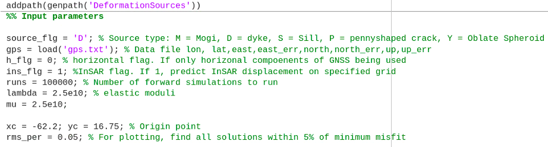
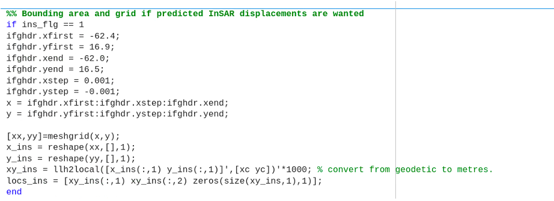
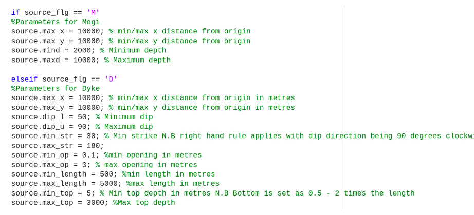
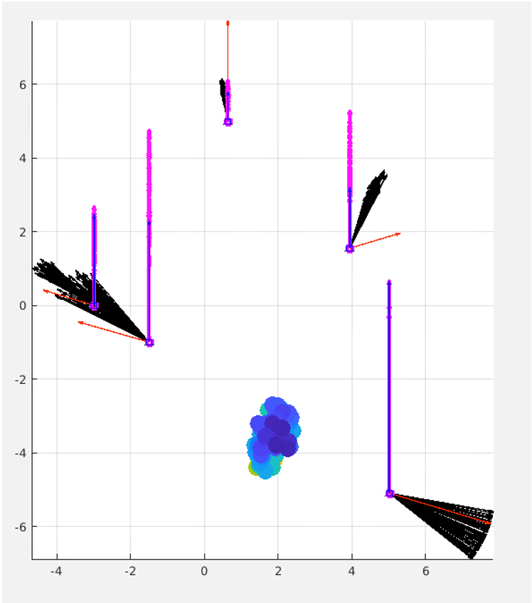
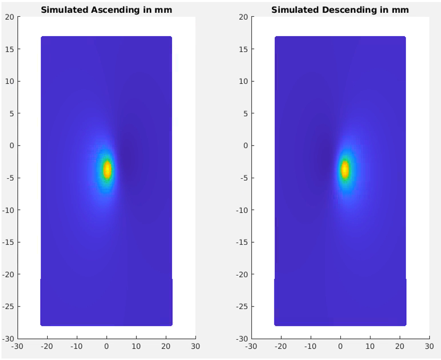

# Forward Model a GNSS Deformation Signal

This workflow runs simple forward models to test whether observed GNSS deformation can be explained by a subsurface source and optionally generates predicted InSAR displacement fields.

This model can be used as a first‑order assessment tool to determine whether the source of deformation is located proximal to the volcano or elsewhere (e.g., offshore or tectonic).

## Background

We can forward model expected InSAR displacements from GNSS observations to help determine whether we expect to see measurable surface deformation from a given signal.

This is particularly useful when GNSS stations show displacement but satellite products are noisy, delayed, or not yet available. Forward modelling provides a first-order estimate of the deformation source geometry and the spatial pattern of displacement we would expect to observe in InSAR.

The model assumes a **homogeneous elastic half-space** and solves deformation using analytical source formulations.

Available source types include:

* **Mogi point source** — magma chamber inflation / deflation  
* **Dyke dislocation** — vertical sheet intrusions  
* **Sill intrusion** — horizontal magma emplacement  
* **Penny-shaped crack** — pressurised cavities  
* **Oblate spheroid** — ellipsoidal pressure sources  

These source geometries are commonly used in volcano geodesy to approximate subsurface pressure changes and intrusion processes.

The code runs a Monte-Carlo style forward search, generating a suite of possible source solutions within defined parameter bounds and ranking them by misfit to the observed GNSS displacement vectors.

This allows rapid assessment of:

* Source depth  
* Location  
* Geometry  
* Volume / pressure change  
* Expected satellite displacement pattern  

---

### Rule of Thumb

GNSS networks are most sensitive to sources located beneath or proximal to the network footprint.

As a first-order guide:

> The horizontal distance from the deformation centre to the edge of the displacement field is approximately equal to the source depth.

This relationship is commonly observed for Mogi-type sources and provides a quick sense check when interpreting model outputs.

---

***Pro's***

* Rapid first-order assessment of deformation source  
* Helps determine whether InSAR should detect the signal  
* Provides expected displacement geometry  
* Useful when satellite data are delayed or incoherent  

***Cons's***

* Assumes homogeneous elastic crust  
* Does not include topography or heterogeneity  
* Non-unique solutions are common  
* Should not be treated as a full inversion  

---

## Running the MATLAB Code

Code execution is controlled by:

```
run_models.m
```

All input parameters, source selections, and model settings are defined within this script.

To run the model, the script requires a data file containing GNSS station locations and displacement vectors.

If no vertical displacement values are available, the horizontal‑only flag can be enabled.

<p align="center">
  <br>
</p>

Key input parameters defined in this section include:

* Source model type  
* GNSS input file  
* Horizontal‑only flag (`h_flg`)  
* Number of model runs  
* Elastic parameters  
* Origin location  
* RMS misfit threshold  

---

## Simulated InSAR Outputs

There is an additional flag option (`ins_flg`) which enables the generation of simulated ascending and descending interferograms based on the best‑fitting model solution.

The spatial bounding area and grid resolution for these simulated interferograms are defined in the next section of the script.

<p align="center">
  <br>
</p>

This section controls:

* Geographic model bounds  
* Grid spacing  
* Area over which InSAR displacement fields are predicted  

---

## Forward Model Parameter Search

After the source type has been selected, the model runs a suite of forward simulations.

Parameters are randomly assigned within the bounds defined in the script.

The total number of simulations is controlled by:

```
runs
```

Higher values increase the search space but also increase runtime.

<p align="center">
  <br>
</p>

Example constraints include:

### Mogi source

* Horizontal search: ±10,000 m from origin  
* Depth range: 2,000 – 10,000 m  

### Dyke / Sill sources

* Dip  
* Strike  
* Opening  
* Length  
* Depth to top  

For dyke and sill models, opening is prescribed within the parameter bounds.

For Mogi, penny‑shaped crack, and spheroid sources, the inversion solves for the best‑fitting volume or pressure change.

---

## Model Outputs

After completion, the model generates plots showing all source solutions that fall within a defined RMS misfit threshold.

Default threshold:

```
rms_per = 0.05
```

This plots all models within 5% of the minimum misfit, though this value can be adjusted in the script.

<p align="center">
  <br>
</p>

**Figure description**

* Coloured dots → Best‑fitting source locations  
* Colour scale → Estimated volume change  
* Red vectors → Observed horizontal GNSS  
* Black vectors → Modelled horizontal GNSS  
* Blue vectors → Observed vertical GNSS  
* Magenta vectors → Modelled vertical GNSS  

---

## Simulated Interferograms

If InSAR simulation is enabled, the script generates predicted unwrapped interferograms for ascending and descending viewing geometries.

<p align="center">
  <br>
</p>

These provide a first‑order comparison between modelled and observed satellite deformation patterns.

---

## Notes

> These are first‑order elastic forward models and should be interpreted cautiously.  
> They are intended as rapid assessment tools rather than full geodetic inversions.

---

## Further Reading — Simple Deformation Modelling

Foundational analytical source models:

* **Mogi (1958)** — Relations between eruptions and ground deformation  
* **Okada (1985)** — Surface deformation due to shear and tensile faults  
* **Yang et al. (1988)** — Spheroidal pressure sources  
* **Fialko et al. (2001)** — Penny-shaped crack models  

These form the analytical basis for most volcano deformation forward models used today.